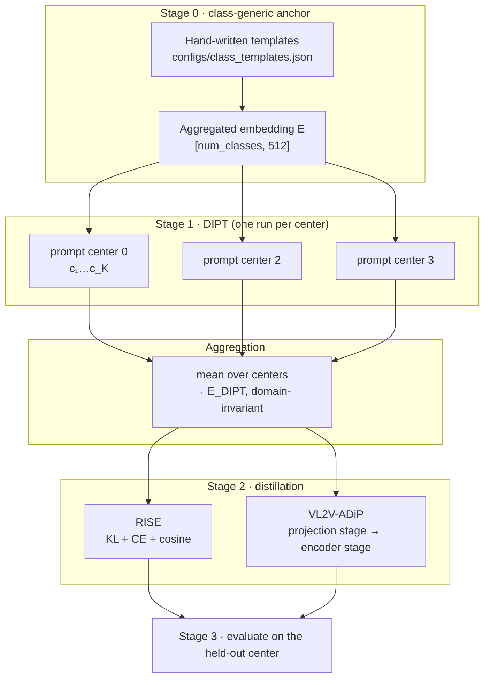

# The DIPT pipeline, end to end

This document is the map of the repository: what the method does, why each stage
exists, which artifact each stage produces, and the exact order in which to run
the scripts. Read it once and you should be able to find your way around every
file here.

- [1. The problem](#1-the-problem)
- [2. The method](#2-the-method)
- [3. Artifacts and how stages connect](#3-artifacts-and-how-stages-connect)
- [4. Order of execution](#4-order-of-execution)
- [5. Repository reference](#5-repository-reference)
- [6. Configuration reference](#6-configuration-reference)
- [7. Where the old code went](#7-where-the-old-code-went)
- [8. Deviations from the original code](#8-deviations-from-the-original-code)

---

## 1. The problem

Histopathology images shift between clinical centers: staining protocols,
scanners and imaging settings all differ. A model trained on hospitals A, B and C
degrades on hospital D. This is **domain generalisation**, and the domains are
the centers.

Pathology vision–language models (VLMs) — **PLIP**, **QuiltNet** and **KEEP** — are trained
on image–text pairs from many sources, which makes them attractive teachers for
knowledge distillation. Two obstacles:

1. **Their zero-shot accuracy is prompt-sensitive.** Rewording the class prompt
   moves the number by several points.
2. **Histopathology centers have no semantic descriptor.** For natural images you
   can write "a *sketch* of a dog"; there is no equivalent phrase for
   "hospital 4". So domain-specific prompts cannot be hand-written at all.

DIPT's answer: **learn** the domain-specific prompts from data, then average them
away, so what reaches the student is domain-*invariant*.

---

## 2. The method



### Stage 0 — the class-generic anchor `E`

For each class we hand-write many phrasings (22 for `normal`, 26 for `tumor` on
Camelyon17), encode them all with the VLM text encoder, and average:

```
E_i = mean over templates of  text_encoder(template)          # then L2-normalised
```

`E` is the *class-generic* representation: it says what a tumour looks like
without reference to any center. It plays three separate roles later, which is
worth keeping straight:

| role | where |
|---|---|
| frozen anchor token inside every DIPT prompt | stage 1 |
| the `Agg. prompt Zero-Shot` baseline | `evaluate_zero_shot.py --prompt-source template` |
| text target of the *original* RISE loss | `train_rise.py --prompt-source template` |

Code: `dipt/prompts/templates.py`, data: `configs/class_templates.json`.

### Stage 1 — Domain-Invariant Prompt Tuning

One prompt is learned **per center**. The prompt for class *i* is a token
sequence in CLIP's embedding space:

```
[SOT]   c₁ c₂ … c_K   a_i   [EOT] …
        └─ learnable ─┘   └─ frozen: E_i
```

`c₁…c_K` are `K` continuous vectors (`--num-context-tokens`, K ∈ {3,4,5,6} in the
experiments), initialised `N(0, 0.02²)` and shared across classes within a center.
The VLM itself stays entirely frozen; only these `K × 512` numbers train.

The objective has two terms:

```
L = CE(logits, y)  +  score_weight · (1 − cos(text_features, E))
     └ supervised ┘     └──────── drift penalty (KgCoOp-style) ────────┘
```

The drift penalty is the load-bearing part. Without it each center's prompt would
wander to its own region of embedding space and averaging them would be
meaningless. With it, all centers stay near the same class-generic anchor — hence
the paper's title, *"all centers are at most a few tokens apart"* — and the mean
is a sensible operation.

Code: `dipt/methods/dipt.py`, `dipt/models/prompt_learner.py`.

### Aggregation

Encode each center's learned prompt through the text encoder, average across the
**training** centers of the current split, and re-normalise:

```
E_DIPT = normalise( mean_over_centers( text_encoder(prompt_center) ) )
```

The per-center variation cancels; what survives is class information that holds
across centers. `E_DIPT` is what stage 2 distils into the student.

Code: `dipt/prompts/learned.py::aggregate_learned_prompts`.

### Stage 2a — RISE

The student is trained with three terms:

```
L = w_kd   · KL( student/T ‖ teacher/T ) · T²      soft labels from the teacher
  + w_cls  · CE( student logits, y )               ground-truth supervision
  + w_dist · ( 1 − cos( student feature, E_y ) )   pull features onto the text embedding
```

Only the third term touches the prompts, and that is exactly where DIPT enters:
swapping `E` (templates) for `E_DIPT` (learned, domain-invariant) is the entire
difference between the RISE baseline and RISE + DIPT.

Code: `dipt/methods/rise.py`.

### Stage 2b — VL2V-ADiP

Two training stages with a dual feature-consistency loss:

```
L = −λ · cos(proj, teacher image feature) − (1 − λ) · cos(proj, E_y)
```

* **stage 1** — student encoder frozen, train the projection layer only. This
  lands the projection in the teacher's embedding space before any encoder weight
  moves, which avoids wrecking the pretrained features.
* **stage 2** — projection frozen, fine-tune the student encoder.
* **stage 3** — inference through a frozen zero-shot head built from `E`.

Code: `dipt/methods/vl2v_adip.py`.

### Self-distillation

Setting `--student vlm` makes the student a **trainable copy of the teacher's own
image encoder** rather than a separate ResNet/ViT. Teacher weights stay frozen;
the copy is fine-tuned so its visual features align with `E_DIPT`. This works with
both methods and both teachers — it is a student choice, not a separate codebase.

> The earlier experiments reported numbers for a *separate* student network. In
> the self-distillation setting the evaluated model **is** the fine-tuned image
> encoder of the VLM, tested on the held-out center.

Code: `dipt/models/students.py::VLMStudent`.

### The evaluation protocol

Leave-one-center-out. One center is reserved for validation in **both** stages
(center 1 for Camelyon17) and never appears in training or test. The remaining
four rotate:

| split | train | validate | test |
|---|---|---|---|
| 1 | 0, 2, 3 | 1 | 4 |
| 2 | 0, 2, 4 | 1 | 3 |
| 3 | 0, 3, 4 | 1 | 2 |
| 4 | 2, 3, 4 | 1 | 0 |

Reported: per-center accuracy and weighted F1, plus **mean** and **worst-case**
across splits — worst-case is what matters for deployment.

Code: `dipt/data/registry.py` (the splits), `dipt/evaluation/` (the metrics).

---

## 3. Artifacts and how stages connect

Stages communicate through files at **deterministic paths**. Nothing is passed by
hand; every downstream stage derives the path it needs from
`(dataset, vlm, k, domain)`.

```
data/camelyon17/<center>/<class>/*.png                       ← download_datasets.py
        │
        ▼
outputs/prompts/<dataset>/<vlm>/k<K>/domain<D>/
        best_prompt_learner.pth                              ← train_domain_prompts.py
        last_prompt_learner.pth
        training_setup.json · history.json · train.log
        │
        ▼   (aggregated across the split's training centers)
outputs/rise/<dataset>/<vlm>/<student>/<prompts>/
        t_0_2_3_v_1_best.pth                                 ← train_rise.py
        config.json · training_summary.json · *.log
        │
outputs/vl2v_adip/<dataset>/<vlm>/<student>/<prompts>/
        t_0_2_3_v_1_stage1_best.pth                          ← train_vl2v_adip.py
        t_0_2_3_v_1_stage2_best.pth
        config.json · *_records.json · train.log
        │
        ▼
outputs/**/evaluation.json + evaluation.txt                  ← evaluate_*.py
outputs/zero_shot/<dataset>_<vlm>_<source>.json              ← evaluate_zero_shot.py
```

Two naming conventions carry meaning:

* **`<prompts>`** is `dipt_k4` / `template` / `handcrafted`, so runs with
  different prompt sources never collide.
* **`t_0_2_3_v_1`** encodes train centers `{0,2,3}` and validation center `1`. The
  evaluators parse this back out and infer the test center as the complement —
  which is why you never have to tell them which center to test on.

---

## 4. Order of execution

### One-time setup

```bash
conda create -n dipt python=3.10 -y && conda activate dipt
pip install -r requirements.txt
python scripts/check_setup.py            # dependencies, GPUs, data layout
```

### Step 1 — data

```bash
python scripts/download_datasets.py --dataset camelyon17
```

Downloads Camelyon17-WILDS and re-groups patches by the `center` column of
`metadata.csv`, **ignoring the official train/val/test split** — holding out a
center is the whole point. Add `--max-per-class-per-center 20000` for a smaller
trial subset.

For Kather19 (optional, needs `pip install staintools spams`):

```bash
python scripts/download_datasets.py --dataset kather19
python scripts/prepare_kather_domains.py --num-domains 6
```

### Step 2 — zero-shot baselines *(optional but recommended)*

```bash
python scripts/evaluate_zero_shot.py          # both teachers × both prompt-free sources
```

Establishes the floor and confirms the data pipeline works before any training.
Cheap: no gradients.

### Step 3 — learn the domain prompts (stage 1)

Run once per `(teacher, K)` you care about. `--domain all` loops over every
non-validation center internally:

```bash
python scripts/train_domain_prompts.py --vlm plip     --domain all -k 4
python scripts/train_domain_prompts.py --vlm quiltnet --domain all -k 3
```

Sanity-check the result before spending real GPU time:

```bash
python scripts/evaluate_zero_shot.py --vlm plip --prompt-source dipt -k 4
```

DIPT prompts should beat the `template` row from step 2. If they don't, stage 2
will not save you — revisit `--lr`, `--score-weight` or `--num-epochs` first.

### Step 4 — distil (stage 2)

Runs all four splits in one invocation. Pick a method, a student, and a prompt
source:

```bash
# ours
python scripts/train_rise.py       --vlm plip --student resnet50_bit --prompt-source dipt -k 4
python scripts/train_vl2v_adip.py  --vlm plip --student resnet50     --prompt-source dipt -k 4

# self-distillation
python scripts/train_rise.py       --vlm quiltnet --student vlm --prompt-source dipt -k 3
python scripts/train_vl2v_adip.py  --vlm quiltnet --student vlm --prompt-source dipt -k 3

# published baselines, for the comparison rows
python scripts/train_rise.py       --vlm plip --prompt-source template
python scripts/train_vl2v_adip.py  --vlm plip --prompt-source handcrafted
```

### Step 5 — evaluate (stage 3)

```bash
python scripts/evaluate_students.py \
    --run-dir outputs/rise/camelyon17/plip/resnet50_bit/dipt_k4 \
    --vlm plip --student resnet50_bit

python scripts/evaluate_vl2v_adip.py \
    --run-dir outputs/vl2v_adip/camelyon17/plip/resnet50/dipt_k4
```

`evaluate_vl2v_adip.py` reads `config.json` from the run directory, so it
reconstructs the right student and prompt source on its own.

### The same thing via the shell wrappers

Every knob is an environment variable; defaults match the paper.

```bash
                 bash experiments/00_zero_shot.sh
VLM=plip     K=4 bash experiments/01_domain_prompts.sh
VLM=plip     K=4 bash experiments/02_rise.sh
VLM=plip     K=4 bash experiments/03_vl2v_adip.sh
VLM=quiltnet K=3 bash experiments/04_self_distill_rise.sh
VLM=quiltnet K=3 bash experiments/05_self_distill_vl2v_adip.sh
VLM=plip     K=4 STUDENT=resnet50_bit bash experiments/06_evaluate.sh
```

### Full sweep for the paper's table

```bash
python scripts/download_datasets.py --dataset camelyon17
bash experiments/00_zero_shot.sh

for VLM in plip quiltnet; do
  K=$([ "$VLM" = plip ] && echo 4 || echo 3)
  VLM=$VLM K=$K bash experiments/01_domain_prompts.sh
  VLM=$VLM K=$K bash experiments/02_rise.sh
  VLM=$VLM K=$K bash experiments/03_vl2v_adip.sh
  VLM=$VLM K=$K bash experiments/04_self_distill_rise.sh
  VLM=$VLM K=$K bash experiments/05_self_distill_vl2v_adip.sh
done
```

Stage 1 must finish before stage 2 for a given `(vlm, K)`; the four splits inside
one stage-2 run are independent and could be parallelised across GPUs with
`--train-doms` and `--gpu-index`.

---

## 5. Repository reference

### `dipt/` — the library

| module | responsibility |
|---|---|
| `paths.py` | repo-relative path resolution; `DIPT_DATA_ROOT` / `DIPT_OUTPUT_ROOT` |
| `cli.py` | shared argparse blocks so every script speaks the same flags |
| `data/datasets.py` | `MultipleDomainDataset` over `root/domain/class/image`; `CyclicDataLoader` |
| `data/registry.py` | class names, domains, validation domain and the leave-one-out splits |
| `data/loaders.py` | DataLoader construction and the dataset-side transform |
| `models/vlm.py` | the `plip` / `quiltnet` / `keep` registry — the only place HF ids and backend dispatch (CLIP vs. KEEP's custom ViT-L/16+BERT) live |
| `models/preprocessing.py` | on-device resize + CLIP/ImageNet normalisation |
| `models/prompt_learner.py` | `PromptLearner`, `TextEncoder`, `PromptedCLIP` (stage 1 model) |
| `models/students.py` | `TimmStudent`, `VLMStudent`, `FrozenTeacher`, `build_student` |
| `prompts/templates.py` | template loading and aggregation into `E` |
| `prompts/learned.py` | prompt checkpoint layout, aggregation, `build_text_targets` |
| `methods/dipt.py` | stage-1 training loop |
| `methods/rise.py` | RISE loss and training loop |
| `methods/vl2v_adip.py` | the VL2V-ADiP algorithm, its stages and checkpoint I/O |
| `evaluation/metrics.py` | metrics, mean/worst-case summary, report writing |
| `evaluation/evaluate.py` | evaluation loops for students, algorithms and zero-shot |
| `utils/` | logging, seeding, config printing, run naming |

Two abstractions do most of the structural work:

* **`StudentModel`** — every student exposes `preprocess` / `encode` / `classify`.
  That is why one RISE loop drives both a ResNet and a fine-tuned CLIP encoder,
  and why self-distillation is a flag rather than a fork.
* **`build_text_targets`** — one function returns the class text embeddings for
  any of the three prompt sources, so the method code never knows or cares which
  one it is using.

### `scripts/` — entry points

| script | stage | what it does |
|---|---|---|
| `check_setup.py` | — | verify install, GPUs, data layout |
| `download_datasets.py` | data | download + regroup by center |
| `prepare_kather_domains.py` | data | Kather19 pseudo-centers via stain augmentation |
| `evaluate_zero_shot.py` | 0 | zero-shot sweep over teachers × prompt sources |
| `train_domain_prompts.py` | 1 | learn per-center DIPT prompts |
| `train_rise.py` | 2 | RISE distillation, all splits |
| `train_vl2v_adip.py` | 2 | VL2V-ADiP, both stages, all splits |
| `evaluate_students.py` | 3 | test RISE / self-distilled students |
| `evaluate_vl2v_adip.py` | 3 | test VL2V-ADiP models |

### `experiments/` — shell wrappers

`common.sh` holds the shared settings and is sourced by `00`–`06`. All paths are
relative to the repo root, and every value is overridable from the environment.

---

## 6. Configuration reference

### Flags shared by every script

| flag | default | meaning |
|---|---|---|
| `--vlm` | `plip` | teacher: `plip`, `quiltnet` or `keep` (the zero-shot script also takes several, or `all`). `keep` needs `--embed-dim 768` on `train_vl2v_adip.py` since its embedding space is 768-d, not 512-d. |
| `--dataset` | `camelyon17` | `camelyon17` or `kather19` |
| `--data-root` | `./data` | prepared datasets |
| `--output-root` | `./outputs` | checkpoints, logs, results |
| `--gpu-index` | `0` | CUDA device |
| `--batch-size` | `128` | batch size |
| `--num-workers` | `4` | DataLoader workers |
| `--seed` | `0` | RNG seed |

### Prompt flags (stage 2 and zero-shot)

| flag | default | meaning |
|---|---|---|
| `--prompt-source` | `dipt` | `dipt` \| `template` \| `handcrafted` |
| `--num-context-tokens`, `-k` | `4` | K; only meaningful with `dipt` |
| `--prompt-root` | `./outputs/prompts` | where stage-1 checkpoints live |

### Stage-1 specifics

| flag | default | meaning |
|---|---|---|
| `--domain` | required | training center, or `all` |
| `--val-domain` | dataset default (`1`) | validation center |
| `--num-epochs` | `1` | epochs |
| `--lr` | `5e-5` | Adam learning rate |
| `--score-weight` | `0.5` | weight of the drift penalty |
| `--eval-interval` | `100` | validate every N batches |
| `--learnable-agg` | off | ablation: also train the anchor token |

### RISE specifics

| flag | default | meaning |
|---|---|---|
| `--student` | `resnet50_bit` | `resnet50_bit` \| `resnet50` \| `vit_base` \| `vit_small` \| `vlm` |
| `--epochs` | `1` | epochs per split |
| `--lr` | `8e-4` | learning rate |
| `--optimizer` | `sgd` | `sgd` or `adam` |
| `--distill-weight` | `0.3` | `w_kd` |
| `--classification-weight` | `0.4` | `w_cls` |
| `--distance-weight` | `0.3` | `w_dist` |
| `-T` | `2.0` | distillation temperature |
| `--eval-interval` | `200` | validate every N batches |
| `--init-head-from-prompts` | off | initialise the linear head from `E` (see §8) |

Self-distillation runs used `(0.0, 0.6, 0.4)` — no KL term, since teacher and
student share an architecture. That is the default in
`experiments/04_self_distill_rise.sh`.

### VL2V-ADiP specifics

| flag | default | meaning |
|---|---|---|
| `--student` | `resnet50` | student backbone |
| `--steps` | `2500` | optimisation steps **per stage** |
| `--lr` | `5e-5` | Adam learning rate |
| `--lam` | `0.5` | image ↔ text trade-off in the DFC loss |
| `--embed-dim` | `512` | projection output dimension |
| `--checkpoint-freq` | `200` | validate every N steps |
| `--stages` | `1 2` | which stages to run |

---

## 7. Where the old code went

The clean repository consolidates three research trees. If you knew the old
layout:

| old | new |
|---|---|
| `utils/avg_template_prompts.py` | `dipt/prompts/templates.py` + `configs/class_templates.json` |
| `utils/load_prompts.py`, `sepehr/load_prompt.py`, the `load_prompt*_qulit.py` variants | `dipt/prompts/learned.py` (deterministic paths, no hard-coded dicts) |
| `dipt/DIPT/prompts_utils.py` | `dipt/models/prompt_learner.py` + `dipt/methods/dipt.py` |
| `dipt/Dataset/datasets.py` | `dipt/data/datasets.py` |
| `dipt/ZeroShot/Plip_zero_shot_domain.py` | `scripts/evaluate_zero_shot.py` (now multi-teacher) |
| `sepehr/train_domain_prompts.py`, `dipt/DIPT/train_domain_specific*.py` | `scripts/train_domain_prompts.py` |
| `sepehr/RISE/train_rise_res{,_k4,_k5,_k6}.py` | `scripts/train_rise.py --num-context-tokens K` |
| `self-distillation/RISE/train_self_rise_*{,_quilt}.py` | `scripts/train_rise.py --student vlm --vlm {plip,quiltnet}` |
| `self-distillation/RISE/utils.py` | `dipt/methods/rise.py` |
| `self-distillation/Vl2V_ADiP/{Plip,Qulitnet}Train{,er}.py` | `dipt/methods/vl2v_adip.py` + `scripts/train_vl2v_adip.py --vlm ...` |
| `dipt/KD_Baselines/VL2V-ADiP/domainbed/**` | absorbed; only `get_optimizer`-style helpers were needed |
| `dipt/KD_Baselines/RISE/RISE/timm/**` (vendored copy) | the released `timm` package |
| `stainaug/class{1..9}.py`, `stain_aug{1..6}.py` | `scripts/prepare_kather_domains.py` |
| `utils/ViTWithProjectionAndClassifier.py` | `dipt/models/students.py` (`TimmStudent` covers it) |

The duplication that disappeared: PLIP and QuiltNet variants of the same trainer
differed only in a model id and a flag; the `k4`/`k5`/`k6` RISE scripts differed
only in one integer; the with-/without-DIPT scripts differed only in which text
embedding they built. All of those are now flags.

---

## 8. Deviations from the original code

Behaviour is preserved except where noted. These are the things worth knowing
before comparing numbers.

1. **Template aggregation order.** The original averaged **raw** text embeddings
   and normalised once at the end. That is the default here
   (`aggregate_template_features(..., normalize_each=False)`). Passing
   `normalize_each=True` averages unit vectors instead — the more common CLIP
   convention, but it does *not* reproduce the published numbers.

2. **A concatenated template.** In `utils/avg_template_prompts.py` the `normal`
   list is missing two commas, so Python silently joined three intended prompts
   into one string: `"a patch of normal lymph node The Healthy lymph nodeA clear
   and normal lymph node."` The class therefore has 22 templates, not 24. It is
   reproduced verbatim in `configs/class_templates.json` so the aggregated
   embedding matches the published runs. Split it into three entries if you want
   the evident intent — the numbers will shift slightly.

3. **Student head initialisation.** Both original RISE scripts contain
   `student.fc.weight.datadata = mean_prompts` — a typo that assigns a stray
   attribute and does nothing, so the head was in fact randomly initialised in
   every published run. That behaviour is the default here;
   `--init-head-from-prompts` enables the intended initialisation.

4. **Preprocessing.** Teacher and student now resize to 224 and normalise on the
   GPU instead of round-tripping every batch through PIL and `CLIPProcessor`.
   Same statistics, substantially faster, but bicubic-on-tensor is not
   bit-identical to PIL — expect small numeric drift.

5. **VL2V-ADiP stage 2** fine-tunes the student encoder only, with the projection
   frozen at its stage-1 solution. This matches the original `train_params`.

6. **Kather19 domains** are synthesised by stain augmentation, since Kather19 has
   no per-center metadata. The paper describes it as three centers; the code
   builds `--num-domains` pseudo-centers (default 6), reproducing the original
   `stainaug/` scripts. Its templates have no counterpart in the original code and
   are new here.
